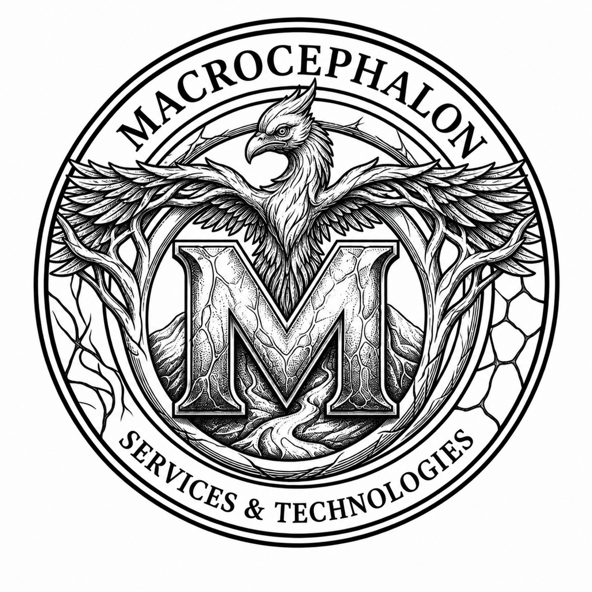

<p align="center">
  
</p>

<h1 align="center">Macrocephalon Services & Technologies TM</h1>

<p align="center">
  <strong>Engineering the Future - From Code to Circuit</strong>
</p>

<p align="center">
  <a href="https://www.macrocephalon.com">
    
  </a>
  <a href="https://github.com/MacrocephalonTechnologies">
    
  </a>
  <a href="https://github.com/MacrocephalonTechnologies/macrocephalon">
    
  </a>
  
  
  
</p>

<p align="center">
  
</p>

---

## Overview

Macrocephalon Services & Technologies TM is a multidisciplinary technology organization focused on software development, AI solutions, engineering projects, research support, and product innovation.

This repository contains the official company website built with Next.js, React, TypeScript, Tailwind CSS, and a custom dark technical visual system inspired by circuits, AI neurons, embers, and engineering interfaces.

## What We Do

### Software & Services

- Web applications and responsive websites
- Custom software and business automation
- API development and system integration
- SaaS platforms and product MVPs
- UI/UX design and database architecture

### AI & Machine Learning

- AI/ML model development
- LLM integration and RAG systems
- Computer vision and NLP solutions
- Chatbots and intelligent automation
- ML pipelines and edge AI deployment

### Engineering Projects

- Academic and final-year project support
- Hardware, embedded systems, and IoT projects
- MATLAB and Simulink simulations
- Research implementation and publishing support
- Multi-branch engineering project execution

## Website Sections

- Home: brand hero, animated gallery, service highlights, and company value points
- About: company profile, mission, technical focus, and operating principles
- Services: detailed service cards with linked divisions and clear deliverables
- Projects: portfolio-oriented project categories and capabilities
- Academic: research, publication, training, and academic support areas
- Contact: service request workflow and client inquiry form

## Current Version Highlights

### Version 1.1

- Gallery slides converted into linked service-style cards
- Shared services catalog added for consistent home and services content
- Service cards now have direct anchors for smooth navigation
- AI neuron overlay added behind the existing circuit-board background
- Ember particles restored with visible downward motion
- Hydration warning suppressed for browser-extension injected HTML attributes
- README refreshed for public company profile use
- Public repository branding added with logo and banner assets

## Tech Stack

| Layer | Tools |
| --- | --- |
| Framework | Next.js App Router |
| UI | React, TypeScript |
| Styling | Tailwind CSS, custom global CSS |
| Components | Radix UI, Lucide React |
| Analytics | Vercel Analytics |
| Storage/API | Next.js API routes, local SQLite service-request data |

## Project Structure

```text
app/                 Next.js app routes, pages, API routes, global styles
components/          Reusable UI and layout components
data/                Shared service catalog data
public/              Website images, gallery assets, service visuals, logos
docs/assets/         README and repository presentation assets
hooks/               Shared React hooks
lib/                 Utility modules
styles/              Additional styling resources
```

## Brand Assets

- README logo: `docs/assets/macrocephalon-services-technologies.png`
- README banner: `docs/assets/macrocephalon-banner.png`
- Public site logo asset: `public/logo.png`

## Trademark & Usage Notice

Macrocephalon, Macrocephalon Services & Technologies, the company logo, brand identity, visual design language, and related marks are trademarks applied for by Macrocephalon Services & Technologies.

This repository is public only for website deployment, company visibility, and portfolio presentation. Public access does not grant permission to copy, reuse, redistribute, modify, publish, commercialize, or derive work from any source code, data, written content, service structure, UI design, images, graphics, logo, branding, or visual assets in this repository.

All rights are reserved unless written permission is granted by Macrocephalon Services & Technologies.

## Run Locally

```bash
npm install
npm run dev
```

Open:

```text
http://localhost:3000
```

## Build

```bash
npm run build
npm run start
```

## Quality Checks

```bash
npx tsc --noEmit
npm run build
```

Note: the repository has a `lint` script, but ESLint must be installed/configured before `npm run lint` can execute successfully.

## Contact

- Website: https://www.macrocephalon.com
- GitHub: https://github.com/MacrocephalonTechnologies
- LinkedIn: coming soon
- Email: support@macrocephalon.com
- Email: admin@macrocephalon.com
- Location: India

---

<p align="center">
  <strong>Macrocephalon Services & Technologies TM</strong><br />
  Software. AI. Engineering. Research.
</p>
